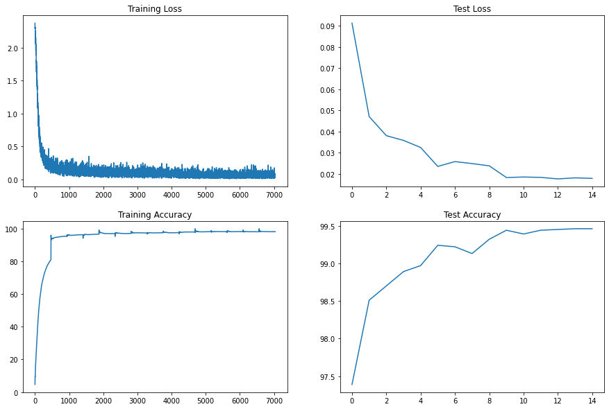

<br/>
<h1 align="center">Session 5: Coding Drill Down
<br/>
<!-- toc -->

### Contributors

| <centre>Name</centre> | <centre>Mail id</centre> |
| ------------ | ------------- |
| <centre>Amit Agarwal</centre>         | <centre>amit.pinaki@gmail.com</centre>    |
| <centre>Pranav Panday</centre>         | <centre>pranavpandey2511@gmail.com</centre>    |
| <centre>Rajamannar A K</centre>         | <centre>rajamannaraanjaram@gmail.com</centre>    |
| <centre>Sree Latha Chopparapu</centre>         | <centre>sreelathaemail@gmail.com</centre>    |\\
<br>

## Objective:

Write a neural network to predict ***MNIST dataset*** with the following limitations
- 99.4% (this must be consistently shown in your last few epochs, and not a one-time achievement)
- Less than or equal to 15 Epochs
- Less than 10000 Parameters.

## Model Initialization:

1. #### HYPERPARAMS:

    num_epochs = 15<br>
    batch_size = 128<br>
    lr = 0.01<br>

2. #### CONSTANTS:

    NUM_CLASSES = 10<br>
    DATA_MEAN = (0.1307,)<br>
    DATA_STD = (0.3081,)<br >


| <centre>Model</centre> | <centre>Target</centre> |<centre>Results</centre> | <centre>Analysis</centre> | <centre> links </centre> |
| ------------ | ------------- | ---------- | --- | ------ |
| MNIST_basic_skeleton | 1. This skeleton of the model is built to check model performance<br>2. No Batch normalisation, dropout and image augmentations used<br>3. No lr_scheduler were used<br>| 1. Train Accuracy - 98.26<br>2. Test Accuracy - 97.96<br> 3. Total parameters - 10,578 | 1. The Model was learning based on the accuracy<br>2. There is also a slight overfit in model<br>3. Adding regularisation and scheduer to impore performance<br> | 1. [Notebook link](./Notebooks/MNIST_basic_skeleton.ipynb)<br> |
| MNIST_Regularization | 1. Model should achieve the target of 99.4 within 10k parameters<br>2. To achieve this we added dropout, lr_scheduler, batchnorm<br>3. In the basic skeleton the parameter count was little above 10k and this was reduced under 10k | 1. Train accuracy - 99.39<br>2. Test accuracy - 99.33<br>3. Total parameters - 8178 | 1. The performance the model reached 99.39<br>2. Overfitting of training data is minimised<br>3. Multiple set of dropout and lr_scheduler values were used<br>4. Dropout of `0` gave better accuracy<br>5. StepLR with step_size of 5 gave better accuracy | 1. [Notebook link](./Notebooks/MNIST_regularization.ipynb)<br> |
| MNIST_augmentation | 1. Model parameters were further reduced below 8k<br>2. Basic Image agumentation were used<br>3. Plotted some incorrect predicted to check was went wrong in previous model | 1. Train accuracy - 98.20<br>2. Test accuracy - 99.46<br>3. Total parameters - 7946 |1. The model is underfitting as we have added rotation to train data<br>2. RandomAffine with +-7 degree rotation, 5 degree shear, 15% translation, and +- 30% scaling is introduced.<br>|. [Notebook link](./Notebooks/MNIST_augmentation.ipynb)<br>|

### Final Model Architecture:


    ----------------------------------------------------------------
            Layer (type)               Output Shape         Param #
    ================================================================
                Conv2d-1           [-1, 12, 26, 26]             108
                  ReLU-2           [-1, 12, 26, 26]               0
           BatchNorm2d-3           [-1, 12, 26, 26]              24
                Conv2d-4           [-1, 16, 24, 24]           1,728
                  ReLU-5           [-1, 16, 24, 24]               0
           BatchNorm2d-6           [-1, 16, 24, 24]              32
                Conv2d-7            [-1, 6, 24, 24]              96
                  ReLU-8            [-1, 6, 24, 24]               0
           BatchNorm2d-9            [-1, 6, 24, 24]              12
            MaxPool2d-10            [-1, 6, 12, 12]               0
               Conv2d-11           [-1, 12, 10, 10]             648
                 ReLU-12           [-1, 12, 10, 10]               0
          BatchNorm2d-13           [-1, 12, 10, 10]              24
               Conv2d-14             [-1, 14, 8, 8]           1,512
                 ReLU-15             [-1, 14, 8, 8]               0
          BatchNorm2d-16             [-1, 14, 8, 8]              28
               Conv2d-17             [-1, 14, 6, 6]           1,764
                 ReLU-18             [-1, 14, 6, 6]               0
          BatchNorm2d-19             [-1, 14, 6, 6]              28
               Conv2d-20             [-1, 14, 6, 6]           1,764
                 ReLU-21             [-1, 14, 6, 6]               0
          BatchNorm2d-22             [-1, 14, 6, 6]              28
    AdaptiveAvgPool2d-23             [-1, 14, 1, 1]               0
               Linear-24                   [-1, 10]             150
    ================================================================
    Total params: 7,946
    Trainable params: 7,946
    Non-trainable params: 0
    ----------------------------------------------------------------
    Input size (MB): 0.00
    Forward/backward pass size (MB): 0.55
    Params size (MB): 0.03
    Estimated Total Size (MB): 0.59
    ----------------------------------------------------------------

### Training Log:

```
 
0%|          | 0/469 [00:00<?, ?it/s]EPOCH: 1
Loss=0.16498884558677673 Batch_id=468 Accuracy=81.06: 100%|██████████| 469/469 [00:22<00:00, 20.50it/s]
  0%|          | 0/469 [00:00<?, ?it/s]
Test set: Average loss: 0.0913, Accuracy: 9739/10000 (97.39%)

EPOCH: 2
Loss=0.2068132609128952 Batch_id=468 Accuracy=95.38: 100%|██████████| 469/469 [00:23<00:00, 20.29it/s]
  0%|          | 0/469 [00:00<?, ?it/s]
Test set: Average loss: 0.0471, Accuracy: 9851/10000 (98.51%)

EPOCH: 3
Loss=0.09336403757333755 Batch_id=468 Accuracy=96.31: 100%|██████████| 469/469 [00:23<00:00, 20.10it/s]
  0%|          | 0/469 [00:00<?, ?it/s]
Test set: Average loss: 0.0381, Accuracy: 9870/10000 (98.70%)

EPOCH: 4
Loss=0.17863857746124268 Batch_id=468 Accuracy=96.66: 100%|██████████| 469/469 [00:23<00:00, 19.93it/s]
  0%|          | 0/469 [00:00<?, ?it/s]
Test set: Average loss: 0.0358, Accuracy: 9889/10000 (98.89%)

EPOCH: 5
Loss=0.10862476378679276 Batch_id=468 Accuracy=97.00: 100%|██████████| 469/469 [00:23<00:00, 20.06it/s]
  0%|          | 0/469 [00:00<?, ?it/s]
Test set: Average loss: 0.0325, Accuracy: 9897/10000 (98.97%)

EPOCH: 6
Loss=0.050012510269880295 Batch_id=468 Accuracy=97.13: 100%|██████████| 469/469 [00:23<00:00, 20.33it/s]
  0%|          | 0/469 [00:00<?, ?it/s]
Test set: Average loss: 0.0235, Accuracy: 9924/10000 (99.24%)

EPOCH: 7
Loss=0.05519614741206169 Batch_id=468 Accuracy=97.44: 100%|██████████| 469/469 [00:23<00:00, 20.15it/s]
  0%|          | 0/469 [00:00<?, ?it/s]
Test set: Average loss: 0.0258, Accuracy: 9922/10000 (99.22%)

EPOCH: 8
Loss=0.07888182252645493 Batch_id=468 Accuracy=97.52: 100%|██████████| 469/469 [00:23<00:00, 20.37it/s]
  0%|          | 0/469 [00:00<?, ?it/s]
Test set: Average loss: 0.0248, Accuracy: 9913/10000 (99.13%)

EPOCH: 9
Loss=0.01957109197974205 Batch_id=468 Accuracy=97.59: 100%|██████████| 469/469 [00:22<00:00, 20.62it/s]
  0%|          | 0/469 [00:00<?, ?it/s]
Test set: Average loss: 0.0238, Accuracy: 9932/10000 (99.32%)

EPOCH: 10
Loss=0.060061078518629074 Batch_id=468 Accuracy=98.02: 100%|██████████| 469/469 [00:22<00:00, 20.69it/s]
  0%|          | 0/469 [00:00<?, ?it/s]
Test set: Average loss: 0.0182, Accuracy: 9944/10000 (99.44%)

EPOCH: 11
Loss=0.07100395113229752 Batch_id=468 Accuracy=98.17: 100%|██████████| 469/469 [00:22<00:00, 20.41it/s]
  0%|          | 0/469 [00:00<?, ?it/s]
Test set: Average loss: 0.0185, Accuracy: 9939/10000 (99.39%)

EPOCH: 12
Loss=0.06369791179895401 Batch_id=468 Accuracy=98.24: 100%|██████████| 469/469 [00:23<00:00, 20.02it/s]
  0%|          | 0/469 [00:00<?, ?it/s]
Test set: Average loss: 0.0183, Accuracy: 9944/10000 (99.44%)

EPOCH: 13
Loss=0.08133206516504288 Batch_id=468 Accuracy=98.25: 100%|██████████| 469/469 [00:22<00:00, 20.63it/s]
  0%|          | 0/469 [00:00<?, ?it/s]
Test set: Average loss: 0.0176, Accuracy: 9945/10000 (99.45%)

EPOCH: 14
Loss=0.04917359724640846 Batch_id=468 Accuracy=98.17: 100%|██████████| 469/469 [00:22<00:00, 20.66it/s]
  0%|          | 0/469 [00:00<?, ?it/s]
Test set: Average loss: 0.0181, Accuracy: 9946/10000 (99.46%)

EPOCH: 15
Loss=0.03378356620669365 Batch_id=468 Accuracy=98.20: 100%|██████████| 469/469 [00:22<00:00, 20.50it/s]

Test set: Average loss: 0.0178, Accuracy: 9946/10000 (99.46%)
```

### Model Performance:

<!-- <p align="center"></p> -->
<p align="center">
  
</p>
